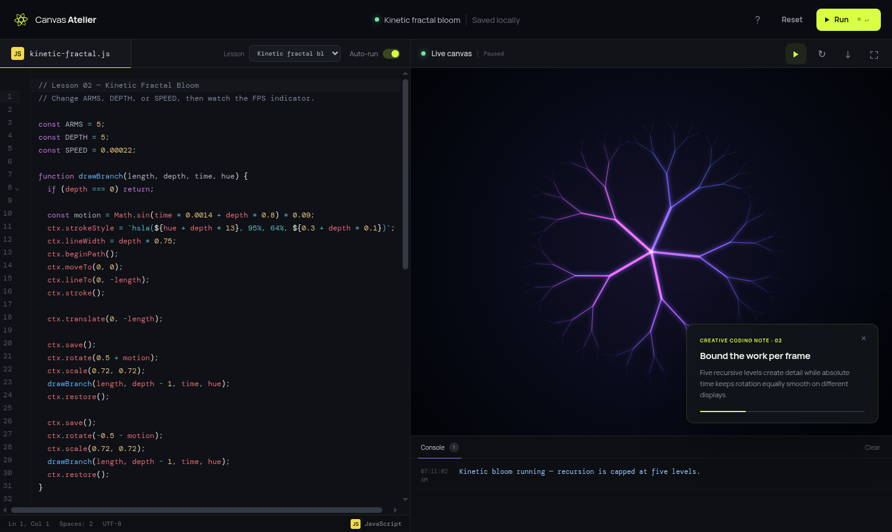

# Canvas Atelier

Canvas Atelier is a browser-based creative-coding studio for learning generative art with JavaScript and the Canvas 2D API. It combines a focused code editor, an isolated live preview, a real error console, guided teaching notes, local persistence, and PNG export.

[](images/studio-overview.png)

The first lesson produces a bioluminescent fractal butterfly. It is intentionally more ambitious than a toy drawing: learners work with recursion, coordinate transforms, gradients, compositing, randomness, interaction, and responsive canvas rendering.

## Run the project

```bash
cd /home/moslem/Desktop/js-art
npm install
npm run dev
```

Open `http://localhost:4173`.

Create an optimized production build with `npm run build`; preview it with `npm run preview`.

## What the MVP includes

- A responsive two-pane workspace: JavaScript editor on the left, artwork on the right.
- Run button and `Ctrl/⌘ + Enter` shortcut.
- Debounced auto-run, so edits update the preview without rerunning on every keystroke.
- A sandboxed iframe runtime that protects the studio from learner code.
- Captured `console.log`, `console.info`, `console.warn`, runtime errors, syntax errors, and unhandled promise rejections.
- Highlighted diagnostic lines and clickable console errors that return focus to learner code.
- Automatic local saving through `localStorage`.
- Rolling per-lesson revision history with idle snapshots, manual versions, and protected restore.
- Versioned JSON project export/import containing source, checkpoint progress, and revision history.
- Named personal sketches with independent drafts and a local create/open/delete gallery.
- Persisted deterministic seeds with reproducible runtime random generators and seed-aware exports.
- A checkpoint-free standalone playground for independent creative work.
- A lazily loaded creative library with 12 fractal templates/components, 12 reusable particle effects, and four original raster textures.
- A sandboxed visual particle configurator with quality scaling, live code generation, particle layer order, and locally saved custom presets.
- CodeMirror 6 syntax highlighting, code folding, bracket matching, search, history, line numbers, and keyboard indentation.
- First-class animation pause/resume and live frame-rate reporting.
- Three selectable lessons with independent locally saved drafts.
- Three guided checkpoints per lesson with hints, code checks, manual visual review, and persisted progress.
- An in-app handbook with a real interface screenshot, workflow guidance, runtime concepts, API reference, and shortcuts.
- High-DPI canvas rendering and responsive resize helpers.
- PNG export, fullscreen preview, restart, reset, and a starter lesson card.
- Keyboard-accessible controls and reduced-motion support.

## Project structure

```text
js-art/
├── index.html                 # Semantic application shell
├── styles.css                 # Visual system and responsive layout
├── app.js                     # Composition root: constructs and connects modules
├── package.json               # Vite, CodeMirror, and project commands
├── public/assets/textures/    # Built-in original raster texture library
├── src/
│   ├── core/EventBus.js       # Observer used between independent modules
│   ├── editor/CodeEditor.js   # CodeMirror adapter
│   ├── library/               # Lazily loaded professional template catalog
│   ├── lessons/               # Extensible lesson definitions and source
│   ├── runtime/               # Iframe runtime and animation scheduler
│   ├── services/              # Persistence and console state
│   └── ui/StudioController.js # UI orchestration
├── test/                      # Node unit tests for core boundaries
├── README.md                  # Setup, features, usage, and roadmap
└── docs/
    ├── ARCHITECTURE.md        # Boundaries, data flow, safety, extension points
    └── CREATIVE-CODING.md     # Canvas API and starter-artwork learning guide
```

## Using the studio

1. Edit `artwork.js` in the left panel.
2. Leave **Auto-run** enabled for quick visual feedback, or disable it while making a large edit.
3. Press **Run** or `Ctrl/⌘ + Enter` to create a fresh preview.
4. Read logs and errors in the console below the canvas.
5. Open **Goals**, work through the current challenge, and use its hint when you get stuck.
6. Press **New mutation** inside the artwork to generate another butterfly.
7. Use the pause button above the preview to freeze or resume animation.
8. Use the down-arrow action to export the current canvas as a PNG.
9. Use **Reset** to restore the lesson. Reset is destructive, so the app asks for confirmation.
10. Open the **Revision history** action to save or restore one of the latest 15 distinct versions.
11. Use **Export** to create an `.atelier.json` backup and **Import** to restore it on another browser.
12. Open **My sketches** to duplicate the current artwork into an independent named workspace.
13. Press the seed control above the preview to generate and rerun a reproducible variation.
14. Open the creative library to start a new sketch or insert a compatible fractal or particle component into the current source.

Each lesson or sketch draft is stored under `canvas-atelier:lesson:<workspace-id>`, checkpoint progress under `canvas-atelier:progress:<workspace-id>`, rolling revisions under `canvas-atelier:revisions:<workspace-id>`, and its seed under `canvas-atelier:seed:<workspace-id>`. Personal sketch metadata is stored separately. This is device-local recovery, not cloud storage or version control. Clearing site data removes it.

## Included lessons

| Lesson | Main concepts | Performance lesson |
| --- | --- | --- |
| Bioluminescent butterfly | Symmetry, recursion, offscreen layers, transforms | Cache expensive static detail and animate the cached bitmap. |
| Kinetic fractal bloom | Bounded recursion, additive color, rotation | Limit recursive depth and use absolute time. |
| Flight study | Bézier curves, character deformation, parallax | Derive position and wing shape from elapsed time. |

The separate **Standalone playground** has no checkpoints and is intended for independent work. The fractal library includes Mandelbrot, Julia, Sierpiński, Barnsley fern, Koch snowflake, dragon curve, recursive canopy, fractal noise, Hilbert curve, L-system plant, Pythagoras tree, and circle-packing bloom. The latter four are reusable components that can be inserted into an existing composition.

The particle library contains flame, smoke, snow, rain, sparks, confetti, fireflies, galaxy, pointer trail, dust, bubbles, and ember presets. **Customize** opens an isolated live preview where emission, budget, forces, size, opacity, shape, blend mode, colors, quality, and particle layer can be adjusted. Configurations can be inserted immediately or saved under **My presets** on this browser.

Particle components use one shared scheduler and named systems, so several effects can coexist without creating a separate animation loop for each effect. Layer sorting is recalculated only when a system is added or removed. Every insertion becomes ordinary editable source and is therefore retained in local drafts, revisions, personal sketches, and project exports. The image section includes original nebula, mineral, paper/ink, and prismatic crystal textures loaded through an export-safe sandbox bridge.

Open the **?** action for the full in-app handbook. The lesson selector keeps a separate editable draft for every lesson, so moving between exercises does not overwrite work.

## Runtime API available to artwork

Every run starts with a clean document containing a canvas. Learner code receives these globals:

| Name | Type | Purpose |
| --- | --- | --- |
| `canvas` | `HTMLCanvasElement` | The drawing surface. |
| `ctx` | `CanvasRenderingContext2D` | The Canvas 2D drawing context. |
| `width` | `number` | Current preview width in CSS pixels. |
| `height` | `number` | Current preview height in CSS pixels. |
| `fitCanvas()` | `function` | Resizes the backing canvas for the viewport and device pixel ratio. Called once automatically. |
| `onResize(callback)` | `function` | Registers artwork that should redraw after preview resize. |
| `createButton(label)` | `function` | Adds a styled button over the canvas and returns it. |
| `seed` | `string` | The current persisted workspace seed. |
| `random()` | `function` | Returns the next deterministic number from 0 inclusive to 1 exclusive. |
| `createRandom(seed)` | `function` | Creates an independent deterministic generator for a custom seed. |
| `loadImageAsset(id)` | `function` | Loads an allow-listed built-in image as an export-safe `HTMLImageElement`. |

Minimal example:

```js
function draw() {
  ctx.fillStyle = "#05070a";
  ctx.fillRect(0, 0, width, height);

  ctx.fillStyle = "#d8ff42";
  ctx.beginPath();
  ctx.arc(width / 2, height / 2, 80, 0, Math.PI * 2);
  ctx.fill();
}

draw();
onResize(draw);
console.log("Artwork ready");
```

## Error behavior

Each run creates a new iframe document and evaluates the current editor contents. If parsing or execution fails, the exception is caught and displayed in the studio console. Global errors and rejected promises are also forwarded.

The preview is intentionally replaced on every run. This clears old animation loops, DOM elements, event listeners, variables, and drawing state. It gives learners a deterministic reset instead of accumulating invisible state across runs.

If an animation uses `requestAnimationFrame`, it runs until the next code execution replaces the iframe:

```js
let angle = 0;

function animate() {
  ctx.clearRect(0, 0, width, height);
  ctx.save();
  ctx.translate(width / 2, height / 2);
  ctx.rotate(angle);
  ctx.fillStyle = "#8f73ff";
  ctx.fillRect(-70, -4, 140, 8);
  ctx.restore();

  angle += 0.01;
  requestAnimationFrame(animate);
}

animate();
```

## Design decisions

### Vite and CodeMirror, without a UI framework

CodeMirror 6 solves a real product problem: learners need trustworthy JavaScript highlighting, selection, history, folding, bracket matching, and keyboard behavior. Vite bundles its ES modules for development and production. The app does not use React or Tailwind because its current state model and custom visual system do not need them. Avoiding those layers keeps canvas/runtime concepts visible and reduces framework coupling.

### Extension-oriented modules

The application uses small modules around genuine change boundaries. `CodeEditor` adapts CodeMirror, `PreviewRuntime` adapts the iframe protocol, `ProjectStorage` is a repository, `EventBus` implements Observer communication, and `StudioController` orchestrates use cases. Lesson definitions are data modules, so new lessons do not require modifying the runtime. See [the architecture guide](docs/ARCHITECTURE.md).

The design follows Open/Closed Principle pragmatically: stable runtime and editor contracts are open to new lesson content, storage implementations, and UI consumers. It does not add abstract base classes or factories before multiple implementations exist.

### JavaScript-only learner surface

The studio owns the page and canvas scaffolding. Learners edit only the creative code, which keeps early lessons focused. A future advanced mode could expose separate HTML, CSS, and JavaScript tabs, but putting all three languages in the first lesson would increase cognitive load.

### Sandboxed execution

Artwork runs inside an iframe with `allow-scripts`, but without `allow-same-origin`. It cannot directly read the parent document or the studio's local storage. Communication uses small `postMessage` events. See [the architecture guide](docs/ARCHITECTURE.md) for the trust boundary and known limitations.

## Verification

Run unit tests and build the production bundle:

```bash
npm run check
npm run build
```

Manual browser checks for this MVP:

1. The initial butterfly renders and the console reports success.
2. Changing a color rerenders after about 650 ms with auto-run enabled.
3. `throw new Error("test")` produces a visible red console entry.
4. Disabling auto-run prevents edits from executing until **Run** is pressed.
5. Refreshing the browser restores the last edit.
6. Pause stops learner `requestAnimationFrame` callbacks; resume continues them.
7. The FPS label updates for animated sketches.
8. **New mutation** changes the artwork without rerunning the program.
9. PNG export downloads a valid image.
10. Fullscreen preview works and exits with `Escape`.
11. Reset restores the starter only after confirmation.
12. At narrow widths the editor and preview stack vertically.
13. Standalone playground runs without showing lesson goals.
14. A library template creates an independent sketch and remains editable after reload.
15. A built-in texture loads in the sandbox and the composed canvas still exports as PNG.
16. Two particle components can be inserted into one standalone sketch, rerun, and restored from local source.

## Current limitations

- Personal sketches, drafts, and revision history are local to one browser; there are no accounts or cloud sync.
- The editor highlights syntax-tree and runtime-error lines, but does not yet provide semantic lint rules, autocomplete, or exact underlined ranges.
- Code runs on the browser's main thread inside the preview. An accidental infinite loop can freeze the preview tab. A production execution service should add a Web Worker or instrumented runtime with time limits.
- The console serialization is deliberately simple. Deep, circular, DOM, and function values are shown as simplified strings.
- External images can make a canvas non-exportable because of browser CORS rules.
- The built-in image library contains four project-created textures with origin/distribution notes. It does not yet manage user uploads or third-party licensed collections; those need IndexedDB storage, explicit license metadata, CORS-safe decoding, and project-file packaging.
- Particle presets are Canvas 2D source components, not a node editor. Very high particle counts still consume main-thread time, and components currently expose configuration by editing their inserted JavaScript.
- Custom preset definitions are device-local and separate from project exports. Their generated component code is portable once inserted, but sharing the reusable preset itself will require a preset export/import format.
- PNG export uses the current preview dimensions. Print-resolution presets, color profiles, SVG, and video export are not implemented yet.
- User code is not a security boundary against network access; iframe content can still make outgoing requests allowed by the page's Content Security Policy. A hosted release should define an explicit CSP.

## Recommended roadmap

Build in vertical slices rather than adding many disconnected controls:

1. **Asset pipeline:** add IndexedDB-backed user image/SVG imports, license/source metadata, thumbnails, and portable project packaging.
2. **Professional export:** add explicit output dimensions, transparent backgrounds, SVG where applicable, and video/frame-sequence export.
3. **Performance insight:** add frame-time statistics, long-frame warnings, and an optional profiler graph.
4. **Diagnostics:** add semantic JavaScript lint rules, exact inline ranges, and safe autocomplete.
5. **Animation tools:** add a timeline and animation cleanup API.
6. **Production hardening:** add CSP, isolate long-running code, add accessibility/browser tests, and deploy immutable assets.

The next milestone should be the asset pipeline and explicit export presets. Those turn the current reusable source library into a more complete professional workflow without hiding the underlying Canvas code.
