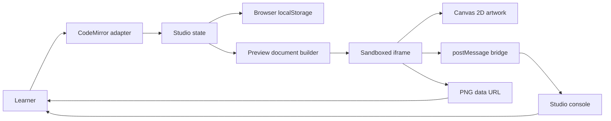
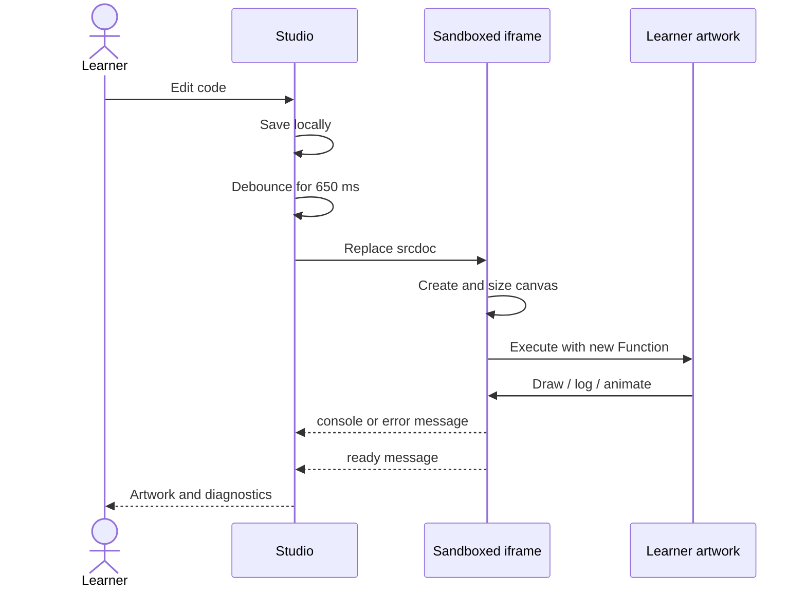

# Architecture

## Goal

Canvas Atelier must let a learner write uncertain JavaScript, run it quickly, see visual output, and understand failures without risking the stability of the surrounding learning interface.

That goal creates two responsibilities:

- The **studio** owns editing, persistence, controls, teaching UI, and diagnostic presentation.
- The **preview runtime** owns the canvas, learner code, animation, artwork DOM, and browser errors.

Keeping those responsibilities separate is the central architectural decision.

## Component map



The learner changes text in the editor. Studio state saves the text and, when requested, builds a complete preview document. The iframe creates the canvas and executes the code. Its bridge returns only structured console, lifecycle, and export messages. The iframe never receives a direct reference to the parent application.

The diagram omits browser internals and future lesson storage. It describes the current single-page MVP, not a multi-user platform.

## Runtime sequence



Replacing `srcdoc` makes every run a clean execution. That is important because canvas state, animation handles, variables, DOM nodes, and event listeners would otherwise survive and create confusing results.

The `650 ms` delay applies only to auto-run. The Run button and keyboard shortcut execute immediately.

## Files and responsibilities

### `index.html`

The HTML file defines semantic regions and controls. It does not contain learner code or runtime templates. Important elements have stable IDs because `app.js` connects behavior to them.

### `styles.css`

The stylesheet contains the visual tokens, two-pane desktop layout, stacked narrow layout, editor presentation, console states, dialog, toast, and teaching card. CSS custom properties at the top are the intended customization surface.

### `app.js`

The entry point is a composition root. It locates DOM elements, constructs the modules, and injects their collaborators. It intentionally contains no runtime or persistence policy.

### `src/editor/CodeEditor.js`

This Adapter exposes `getValue`, `setValue`, `focus`, and lifecycle callbacks while hiding CodeMirror transactions and extensions. Replacing CodeMirror would affect this module and the dependency list, not the controller.

### `src/runtime/PreviewRuntime.js`

This Adapter owns iframe document construction, run identity, animation commands, exports, and message validation. The runtime can grow independently from lesson data.

### `src/services`

`ProjectStorage` implements the Repository pattern around browser storage. `ConsoleStore` owns normalized diagnostic state. Both accept collaborators or inputs that make them testable without a browser UI.

### `src/core/EventBus.js`

The small Observer implementation communicates runtime events without making the runtime import the UI controller. It returns an unsubscribe function to prevent listener leaks when future workspaces are mounted and unmounted.

### `src/lessons`

Each lesson exports metadata and learner source. Adding another lesson is an additive change: register a new object instead of editing sandbox internals. A catalog/registry becomes useful when the second lesson is added.

### `src/ui/StudioController.js`

The controller coordinates run, reset, save, console rendering, animation state, export, and dialogs. It depends on the small module contracts rather than browser-library internals.

## Preview document construction

`buildPreviewDocument(source, runId)` returns a complete HTML string. It includes:

- A full-window canvas.
- Minimal preview-only styles.
- A message helper that includes the current `runId`.
- Console wrappers.
- Global error and promise-rejection handlers.
- High-DPI canvas sizing.
- A controllable `requestAnimationFrame` scheduler and FPS reporter.
- The learner-facing helper API.
- Export request handling.
- Learner code execution inside `try/catch`.

The source is encoded with `JSON.stringify` before insertion. Closing script sequences are escaped to prevent the browser from ending the runtime script early.

## Message protocol

Messages from the preview have this shared shape:

```js
{
  source: "canvas-atelier-preview",
  runId: 3,
  type: "console",
  // message-specific fields follow
}
```

Current message types:

| Direction | Type | Payload | Meaning |
| --- | --- | --- | --- |
| Preview → studio | `console` | `level`, `values` | Render a log or error row. |
| Preview → studio | `ready` | none | Initial synchronous execution ended. |
| Preview → studio | `export` | `dataUrl` | Download the encoded PNG. |
| Preview → studio | `fps` | `fps` | Report executed learner animation callbacks. |
| Studio → preview | `atelier-export` | none | Ask the preview to encode its canvas. |
| Studio → preview | `atelier-animation-state` | `paused` | Pause or resume learner animation callbacks. |

The studio validates `event.source`, the protocol `source`, and `runId`. An old frame may finish after a newer run has started; its messages must not contaminate the current console. A production version should also validate message payload schemas.

## Animation scheduling

The preview captures the browser's native animation functions and exposes controlled replacements to learner code. Each learner callback receives a public ID mapped to its native frame request. Pausing holds pending callbacks without destroying them; resuming schedules them again. Cancellation works for both scheduled and held callbacks.

FPS counts executed learner callbacks rather than the runtime's monitoring loop. This distinguishes an animated sketch from an idle canvas. The initial lesson also paints once synchronously so throttled tabs and static captures still display meaningful artwork before the first animation frame.

## Canvas sizing

CSS pixels and canvas backing pixels are different. A 700 CSS-pixel canvas on a device pixel ratio of 2 needs a 1400-pixel backing store to remain sharp.

`fitCanvas()` performs four steps:

1. Read the iframe viewport in CSS pixels.
2. Cap device pixel ratio at 2 to control GPU and memory cost.
3. Resize the canvas backing dimensions.
4. Apply a context transform so learner coordinates remain in CSS pixels.

Resizing a canvas clears its bitmap and drawing state. That is why registered `onResize` callbacks redraw after `fitCanvas()`.

## Isolation and security

The iframe sandbox currently has:

```html
sandbox="allow-scripts allow-downloads"
```

Without `allow-same-origin`, the generated document receives an opaque origin. Learner code cannot directly traverse into the parent DOM, read the studio's storage, or call parent functions. PNG data moves through the message bridge.

Important limitations:

- Sandbox isolation does not stop infinite loops; both documents may share the browser UI thread.
- Sandbox isolation does not automatically block network requests.
- `postMessage("*")` is acceptable for an opaque-origin child, but the parent must strictly validate inbound data.
- This runtime is suitable for local learning and an MVP, not arbitrary hostile-code execution.

A hardened hosted version should combine the iframe with a restrictive Content Security Policy, a Worker-based execution strategy where possible, resource budgets, message schemas, and security tests.

## State and persistence

The current state is deliberately small:

- Editor text.
- Auto-run timer.
- Save timer.
- Current console messages.
- Current run ID.

Only editor text persists, using `localStorage`. UI preferences and console history do not. This prevents stale diagnostics and makes every browser load begin with a current execution.

Saving is debounced by `350 ms`. Execution is debounced separately by `650 ms`. These timers solve different problems: reducing storage writes and preventing expensive redraws during typing.

## Failure modes

| Failure | Current behavior | Future improvement |
| --- | --- | --- |
| Syntax error | Caught by `new Function`; shown in red. | Parse before run and highlight the exact range. |
| Synchronous runtime error | Caught and reported. | Map stack locations back to editor lines. |
| Async error | Global error/rejection handler reports it. | Preserve richer structured stack data. |
| Infinite loop | Browser tab can become unresponsive. | Worker execution or instrumentation with a time budget. |
| Circular console value | Converted to a string. | Interactive object inspector with depth limits. |
| Canvas export after cross-origin image | Browser throws a security error. | Explain CORS and offer asset proxy rules. |
| Storage unavailable | Session works; saving label reports failure. | In-memory fallback and exportable project file. |

## Testing strategy

The runtime bridge carries the greatest behavioral risk. Add tests in this order:

1. Unit-test source encoding, console serialization, and cursor calculations after extracting pure functions.
2. Browser integration-test successful code, syntax errors, thrown errors, async rejections, and stale run IDs.
3. Browser-test local persistence, reset confirmation, export, and keyboard actions.
4. Add visual regression coverage for desktop and narrow layouts only after the UI stabilizes.

End-to-end tests are justified here because iframe behavior, canvas export, browser storage, and `postMessage` cannot be proven by Node unit tests alone.
