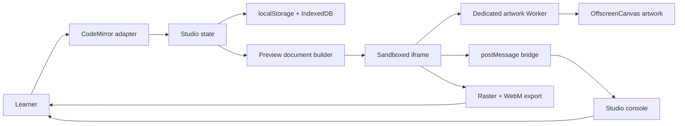
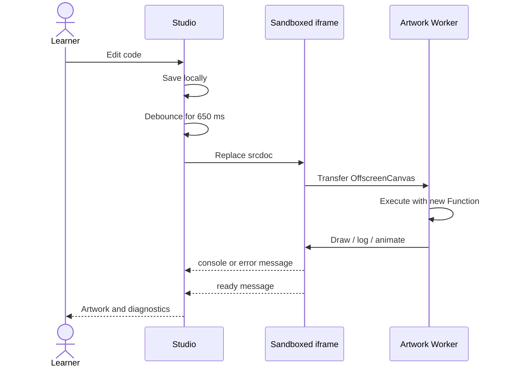

# Architecture

## Goal

Canvas Atelier must let a learner write uncertain JavaScript, run it quickly, see visual output, and understand failures without risking the stability of the surrounding learning interface.

That goal creates two responsibilities:

- The **studio** owns editing, persistence, controls, teaching UI, and diagnostic presentation.
- The **preview runtime** owns the canvas, learner code, animation, artwork DOM, and browser errors.

Keeping those responsibilities separate is the central architectural decision.

## Component map



The learner changes text in the editor. Studio state saves the text and, when requested, builds a preview document. The iframe transfers its canvas to a dedicated Worker, which executes artwork code and renders through `OffscreenCanvas`. The iframe proxies UI controls, pointer input, assets, lifecycle events, and exports. Neither the Worker nor iframe receives a direct reference to the parent application.

The diagram omits browser internals and deployment infrastructure. It describes the editor and local persistence path; the optional Docker identity boundary is documented separately in [Authentication and deployment](AUTHENTICATION.md). Authentication does not yet move project data out of browser storage.

## Runtime sequence



Replacing `srcdoc` makes every run a clean execution. That is important because canvas state, animation handles, variables, DOM nodes, and event listeners would otherwise survive and create confusing results.

The `650 ms` delay applies only to auto-run. The Run button and keyboard shortcut execute immediately.

## Files and responsibilities

### `index.html`

The HTML file defines semantic regions and controls. It does not contain learner code or runtime templates. Important elements have stable IDs because `app.js` connects behavior to them.

### `styles.css`

The stylesheet contains the visual tokens, two-pane desktop layout, stacked narrow layout, editor presentation, console states, dialog, toast, and teaching card. CSS custom properties at the top are the intended customization surface.

### `app.js`

The entry point is a composition root. It locates DOM elements, constructs the modules, and injects their collaborators. It intentionally contains no runtime or persistence policy.

### `src/editor/CodeEditor.js`

This Adapter exposes `getValue`, `setValue`, `focus`, and lifecycle callbacks while hiding CodeMirror transactions and extensions. Replacing CodeMirror would affect this module and the dependency list, not the controller.

### `src/runtime/PreviewRuntime.js`

This Adapter owns iframe/Worker document construction, run identity, animation and stop commands, exports, and message validation. `WorkerPreviewDocument` contains the Worker API shim and proxy protocol so execution policy remains separate from controller behavior.

### `src/services`

`ProjectStorage` implements the Repository pattern around localStorage. `UserAssetStore` owns IndexedDB blobs and SVG sanitization. `ProjectFile` defines and validates the portable, versioned JSON boundary. `LayerSource` manages portable source markers, and `ConsoleStore` owns normalized diagnostic state. These services keep storage and serialization policy out of the UI controller.

### `src/core/EventBus.js`

The small Observer implementation communicates runtime events without making the runtime import the UI controller. It returns an unsubscribe function to prevent listener leaks when future workspaces are mounted and unmounted.

### `src/lessons`

Each lesson exports metadata and learner source. `LessonCatalog` indexes those definitions and provides a safe default. Adding another guided lesson is an additive change: create a module and register its object without editing sandbox internals. Each lesson receives an independent persisted draft.

Personal sketches are dynamic lesson-shaped workspaces. Their stored metadata identifies a base lesson and a creation-time starter source. At bootstrap, the composition root validates that base lesson, constructs a personal definition, and registers it with the same catalog. This lets editor, runtime, checkpoints, revision history, and reset behavior remain shared. The catalog supports runtime add/remove operations, while the three guided definitions remain immutable content.

The standalone playground is a built-in checkpoint-free definition. It deliberately uses the same lesson-shaped contract so independent work does not fork the runtime or persistence architecture. The controller hides goal UI when the current definition has no checkpoints.

### `src/library`

`FractalCatalog` is the small generic index used by the fractal, particle, and image collections. Entries contain discovery metadata and a complete editable `source`. Reusable entries also provide a `snippet`, which the editor appends to the current project after creating a protected revision. The resulting component is normal project source, so it participates in saving, revision history, personal sketches, and portable project files without a second persistence format.

The catalog is dynamically imported only when its dialog opens; large source strings therefore do not increase the initial editor bundle. Creating from a template produces a personal sketch based on the standalone playground, giving it an independent source, seed, reset baseline, revisions, and project-file identity.

Library templates follow four constraints: deterministic supplied randomness, responsive redraw through `onResize`, bounded recursion/particle/pixel budgets, and no external network assets. Insertable snippets use an IIFE to avoid leaking local names into learner code.

Particle snippets additionally share `globalThis.AtelierParticles`. The first inserted effect installs pointer tracking, a named-system registry, and one animation scheduler. Later effects reuse it; inserting the same preset again replaces its previous named system. This avoids a separate permanent animation loop per preset while keeping each preset readable and editable. Particle systems draw by `zIndex`; placing the whole particle scheduler behind unrelated user animation still requires manual composition-order changes.

The particle configurator uses `buildPreviewDocument` to render generated source in a second sandboxed iframe. Preview messages are ignored by the primary runtime because its protocol validates the sending frame. Performance profiles scale the configured maximum and emission rate, while `zIndex` orders particle systems; the sorted system list is recomputed only when systems change.

Custom presets are validated configuration records in `ProjectStorage`, bounded to 20 entries. Source code is regenerated through the same particle-entry factory used by built-ins. This avoids persisting duplicated engine strings while ensuring inserted effects remain ordinary, portable project source. Project format version 2 packages preset definitions so the reusable configurations can move with a workspace.

### Built-in and user assets

`AssetStore` owns an allow-list of project-bound image IDs and caches in-flight conversions. Built-ins resolve from same-origin files; user records resolve from IndexedDB blobs. Learner code calls `loadImageAsset(id)` inside the opaque-origin sandbox. The preview sends a run-scoped request; the studio validates the ID, enforces a 12 MB limit, converts the blob to a data URL, and returns it. Stale-run responses are discarded.

This bridge solves two practical problems. Learner code cannot request arbitrary parent files through the API, and drawing the returned data URL does not taint the canvas. Uploaded PNG, JPEG, WebP, and sanitized SVG files live in IndexedDB with a license note. Project export packages only user assets referenced by `loadImageAsset("user-…")`, keeping unrelated library content out of the portable file.

### Portable composition layers

Inserted components are wrapped in `// @atelier-layer` source markers containing small JSON metadata. `LayerSource` parses and updates these blocks without hiding generated code from the learner. Runtime preparation removes disabled layer bodies and applies opacity or blend wrappers. The format remains plain JavaScript, degrades safely in another editor, and avoids a second opaque scene-graph representation.

Lessons also define ordered checkpoints. A checkpoint contains an ID, teaching copy, a hint, and either a small source validator or a `manual` flag for visual review. Validators are learning aids, not secure grading: they confirm an explicit code constraint while the learner remains responsible for judging the artwork.

### `src/ui/StudioController.js`

The controller coordinates run, reset, save, console rendering, animation state, export, and dialogs. It depends on the small module contracts rather than browser-library internals.

## Preview document construction

`buildPreviewDocument(source, runId)` returns a small iframe host document plus an encoded Worker program. Together they include:

- A full-window canvas.
- Minimal preview-only styles.
- A message helper that includes the current `runId`.
- Console wrappers.
- Worker error and promise-rejection handlers.
- High-DPI canvas sizing.
- A controllable `requestAnimationFrame` scheduler and FPS reporter.
- A persisted seed plus deterministic `random()` and `createRandom(seed)` helpers.
- An asynchronous `loadImageAsset(id)` helper backed by the allow-listed studio bridge.
- The learner-facing helper API.
- Exact-size raster export and iframe-owned WebM recording.
- Learner code execution inside `try/catch`.

The source is encoded with `JSON.stringify` before insertion. Closing script sequences are escaped to prevent the browser from ending the runtime script early.

## Message protocol

Messages from the preview have this shared shape:

```js
{
  source: "canvas-atelier-preview",
  runId: 3,
  type: "console",
  // message-specific fields follow
}
```

Current message types:

| Direction | Type | Payload | Meaning |
| --- | --- | --- | --- |
| Preview → studio | `console` | `level`, `values` | Render a log or error row. |
| Preview → studio | `diagnostic` | `message`, `stack`, `line`, `column` | Highlight and navigate to a learner-code failure. |
| Preview → studio | `asset-request` | `assetId`, `requestId` | Request an allow-listed built-in image. |
| Preview → studio | `ready` | none | Initial synchronous execution ended. |
| Preview → studio | `export` | `dataUrl`, `mimeType` | Download an encoded still image or WebM recording. |
| Preview → studio | `fps` | `fps` | Report executed learner animation callbacks. |
| Studio → preview | `atelier-export` | dimensions, format, quality, transparency | Ask the Worker to render a still image. |
| Studio → preview | `atelier-video-export` | duration, frame rate | Ask the iframe to record its visible canvas stream. |
| Studio → preview | `atelier-stop` | none | Terminate the artwork Worker. |
| Studio → preview | `atelier-animation-state` | `paused` | Pause or resume learner animation callbacks. |
| Studio → preview | `atelier-asset-response` | `requestId`, `dataUrl` or `error` | Resolve an image request without tainting canvas export. |

The studio validates `event.source`, the protocol `source`, and `runId`. An old frame may finish after a newer run has started; its messages must not contaminate the current console. Payloads are accepted only through the small command set, though deeper schema validation remains useful hardening.

Learner functions receive an `artwork.js` source label. Runtime stack locations are adjusted for the two wrapper lines inserted by the `Function` constructor, then forwarded as structured diagnostics. Compile-time syntax errors do not consistently include a source location across browsers, so CodeMirror's syntax tree supplies an editor location when available. Console rows with locations are mouse- and keyboard-navigable.

## Animation scheduling

The preview captures the browser's native animation functions and exposes controlled replacements to learner code. Each learner callback receives a public ID mapped to its native frame request. Pausing holds pending callbacks without destroying them; resuming schedules them again. Cancellation works for both scheduled and held callbacks.

FPS counts executed learner callbacks rather than the runtime's monitoring loop. This distinguishes an animated sketch from an idle canvas. The initial lesson also paints once synchronously so throttled tabs and static captures still display meaningful artwork before the first animation frame.

Complex animated art should separate expensive generation from cheap per-frame motion. The butterfly renders recursive glowing paths to an offscreen canvas when its mutation or size changes. Its animation loop only paints a background and transforms the cached image. The kinetic fractal intentionally redraws recursion, but caps depth and avoids per-branch shadow blur. The flight lesson draws only a few Bézier paths per frame.

## Canvas sizing

CSS pixels and canvas backing pixels are different. A 700 CSS-pixel canvas on a device pixel ratio of 2 needs a 1400-pixel backing store to remain sharp.

`fitCanvas()` performs four steps:

1. Read the iframe viewport in CSS pixels.
2. Cap device pixel ratio at 2 to control GPU and memory cost.
3. Resize the canvas backing dimensions.
4. Apply a context transform so learner coordinates remain in CSS pixels.

Resizing a canvas clears its bitmap and drawing state. That is why registered `onResize` callbacks redraw after `fitCanvas()`.

## Isolation and security

The hosting iframe sandbox currently has:

```html
sandbox="allow-scripts allow-downloads"
```

Without `allow-same-origin`, the generated document receives an opaque origin. Learner code executes one boundary deeper in a dedicated Worker and cannot traverse into the parent DOM, read studio storage, or call parent functions. PNG and asset data move through the validated message bridge.

Important limitations:

- A five-second initialization watchdog terminates synchronous infinite loops, and the Stop command can terminate running artwork without losing source.
- An infinite loop started later from a user interaction is still terminable with Stop, but cannot report diagnostics while the Worker is blocked.
- The application CSP blocks arbitrary outbound connections and disallows objects, base URLs, and form submission targets.
- `postMessage("*")` is acceptable for an opaque-origin child, but the parent must strictly validate inbound data.
- Browsers without Worker-backed `OffscreenCanvas` receive a compatibility error; the runtime deliberately avoids an unsafe main-thread fallback.
- This improves availability isolation, but it is not a complete hostile-code security boundary.

The HTML includes a restrictive CSP compatible with generated iframe and Worker blobs. A production host should send the same policy as an HTTP response header, then add complete message schemas, memory/resource budgets, and adversarial security tests. The necessary `unsafe-inline`/`unsafe-eval` allowances are contained by the opaque iframe and Worker boundary but remain an explicit trade-off.

## State and persistence

The current state is deliberately small:

- Editor text.
- Auto-run timer.
- Save timer.
- Current console messages.
- Current run ID.
- Current checkpoint and completed checkpoint IDs.
- Unsnapshotted-change state and revision timer.
- Personal sketch metadata and the active dynamic workspace ID.
- Current workspace seed.
- IndexedDB user-asset metadata and blobs.
- Custom particle presets.

Editor text, completed checkpoint IDs, and revision history persist using separate `localStorage` keys. UI preferences, the currently displayed checkpoint, and console history do not. Keeping progress separate means resetting code does not erase completed learning work, while every browser load still begins with a current execution.

Revision history is intentionally bounded and local. After five seconds without another edit, the controller stores a snapshot unless the newest revision already has identical source. Reset, restore, and a quick lesson switch capture unsnapshotted work first. Each lesson retains its 15 newest distinct revisions; this provides recovery without pretending to be source control or cloud backup.

Personal sketch metadata is also bounded to 30 entries. Deleting a sketch removes its draft, checkpoint progress, and revisions together. When the deleted sketch is active, the controller switches to its base lesson before removing storage so normal lesson-switch saving cannot recreate deleted data.

## Project-file boundary

Canvas Atelier exports one workspace as a versioned `.atelier.json` document. Version 2 contains the schema identifier, export time, lesson identity, current source, deterministic seed, completed checkpoint IDs, at most 15 revisions, custom particle presets, and referenced user assets with license metadata. Version 1 remains accepted and migrates to empty preset and asset collections. Local revision IDs are omitted because they have meaning only inside the originating browser.

## Deterministic randomness

Every workspace owns a persisted string seed. The runtime hashes that seed into a small stateful pseudo-random generator and exposes it as `random()`. `createRandom(customSeed)` creates an independent sequence, which is useful when separate artwork systems must remain stable even if another system consumes additional values. The studio does not replace `Math.random()`; using it remains an explicit choice to produce nondeterministic output.

Rerunning source resets `random()` to the beginning of the current seed's sequence. Generating a new seed persists it and starts a clean run. Personal sketches copy their source workspace's seed at creation, project files carry it between browsers, and exported filenames include it so a rendered artifact can be traced back to its variation. Determinism covers code using the supplied generators; timestamps, browser dimensions, fonts, external assets, and native `Math.random()` can still change pixels.

Import is a validation boundary. Files above 25 MB, malformed JSON, unknown schemas, unsupported versions, missing source, invalid embedded asset data, and unavailable base lessons are rejected before the target draft changes. Checkpoint IDs are intersected with the installed lesson, malformed revisions are dropped, and the existing target draft is snapshotted before an accepted import. A personal sketch whose local ID is unknown can be recreated with a new local ID when its base lesson is installed. The format is portable recovery data, not an executable package installer; imported JavaScript still runs through the normal sandbox runtime.

Saving is debounced by `350 ms`. Execution is debounced separately by `650 ms`. These timers solve different problems: reducing storage writes and preventing expensive redraws during typing.

## Failure modes

| Failure | Current behavior | Future improvement |
| --- | --- | --- |
| Syntax error | Caught by `new Function`; syntax-tree line is highlighted when available. | Add educational explanations for common parser failures. |
| Synchronous runtime error | Caught, mapped to learner source, and made navigable. | Preserve structured stack frames across browsers. |
| Async error | Global error/rejection handler reports and maps it when a learner stack frame exists. | Group repeated animation errors. |
| Infinite loop | Initialization is terminated after five seconds; Stop remains usable because execution is in a Worker. | Add configurable CPU budgets and repeated-loop guidance. |
| Circular console value | Converted to a string. | Interactive object inspector with depth limits. |
| Unsupported remote image | Network access is blocked and the asset bridge rejects unknown IDs. | Add a server-side licensed asset ingestion service if required. |
| Storage unavailable | Session works; saving label reports failure and revisions cannot persist. | In-memory fallback and exportable project file. |

## Testing strategy

The runtime bridge carries the greatest behavioral risk. The release strategy is:

1. Unit-test source encoding, project validation, layers, seeds, storage logic, diagnostics, and cursor calculations.
2. Browser integration-test successful code, syntax errors, thrown errors, async rejections, stale run IDs, and infinite loops.
3. Browser-test IndexedDB asset portability, still/video export, persistence, reset confirmation, and keyboard actions.
4. Add automated cross-browser and visual regression coverage for desktop and narrow layouts as the next release milestone.

End-to-end tests are justified here because iframe behavior, canvas export, browser storage, and `postMessage` cannot be proven by Node unit tests alone.
