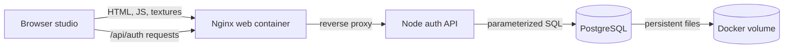
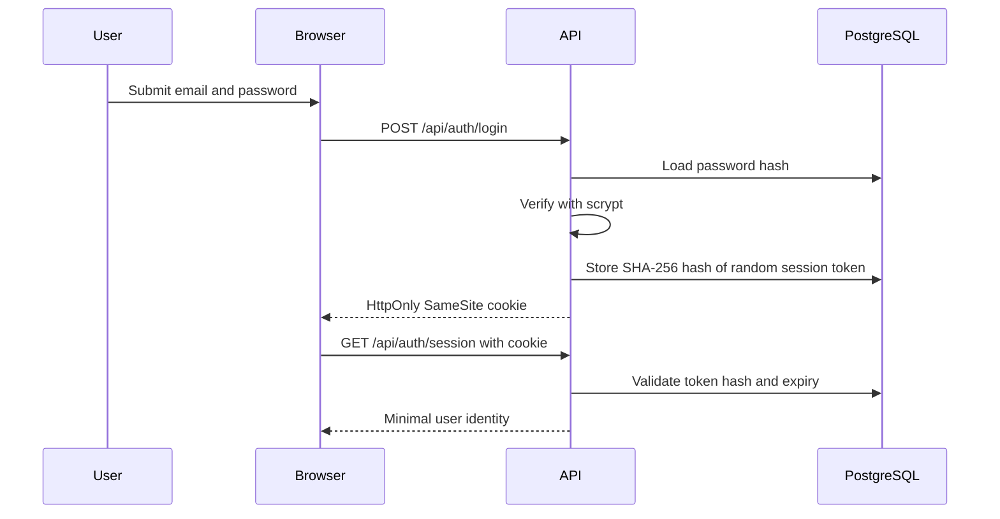

# Authentication and deployment

Canvas Atelier has two deliberate deployment modes:

- The GitHub Pages portfolio demo is public, anonymous, and browser-local.
- The Docker deployment enables email/password accounts through a same-origin API and PostgreSQL.

Authentication currently establishes identity. It does not imply that sketches, revisions, presets, or assets are synchronized to the server.

## Architecture

`Browser studio` is the existing Vite application. `Nginx` serves its immutable bundle and keeps API calls same-origin. `Node auth API` owns credential validation, password hashing, rate limiting, and sessions. `PostgreSQL` stores users and hashed session tokens, while the Docker volume preserves those records across container replacement.

The browser-to-Nginx arrows represent public HTTP traffic. Nginx forwards only `/api/` traffic to the private API container. The API is the only component that talks to PostgreSQL; neither the browser nor Nginx receives database credentials. This design describes one-host infrastructure. Multi-host failover, centralized rate limiting, email verification, password reset, and cloud project storage are not included yet.

## Authentication flow

The password is sent only over the deployment's HTTPS connection. The API derives and compares the password hash; plaintext passwords are never stored. A successful login creates a random opaque token. The browser holds it in an HttpOnly cookie, and PostgreSQL holds only its SHA-256 hash. JavaScript cannot read the cookie. The current in-memory rate limiter is suitable for one API replica; multiple replicas require a shared limiter such as Redis or a gateway policy.

## Local setup

1. Copy `.env.example` to `.env`.
2. Replace `POSTGRES_PASSWORD` with a long random value.
3. Run `docker compose up --build`.
4. Open `http://localhost:8080` and create an account.

The database schema in `db/001-auth.sql` runs when PostgreSQL creates a new volume. Later schema changes should use an explicit migration tool rather than editing an initialization file and expecting an existing volume to rerun it.

## Production checklist

- Put the web container behind HTTPS.
- Set `AUTH_ORIGIN=https://your-domain.example` exactly.
- Set `COOKIE_SECURE=true`.
- Store `POSTGRES_PASSWORD` in the hosting platform's secret manager, not in Git.
- Back up the `postgres-data` volume and test restoration.
- Add email verification, password reset, audit events, and centralized rate limiting before accepting untrusted public signups.
- Add owner IDs and authorization checks before introducing cloud project storage.

## Portfolio demo setup

GitHub Pages is a static host, so it cannot run Docker or PostgreSQL. The Pages workflow builds without `VITE_ACCOUNT_MODE=api`; the UI consequently identifies itself as a demo and never sends account requests.

In GitHub, select **Settings → Pages → GitHub Actions**, then push `main`. The workflow uses the `/canvas-atelier/` Vite base path so JavaScript chunks, help imagery, and built-in textures resolve under the project URL.
